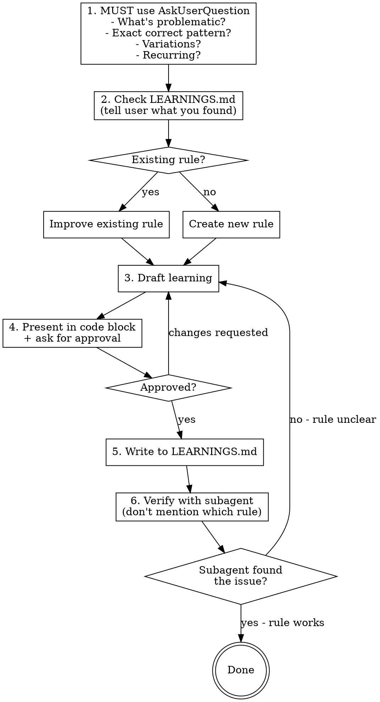

# Learning from Anti-Patterns

Transform anti-patterns into LEARNINGS.md entries. Ensures rules are actionable and verified.

## Quick Reference

| Step | Action |
|------|--------|
| 1 | **MUST use AskUserQuestion** to clarify before proceeding |
| 2 | Check LEARNINGS.md → tell user if improving existing or creating new |
| 3 | Draft using template (Do/Don't MUST show same scenario) |
| 4 | Present in code block + ask "Write this, or changes needed?" |
| 5 | Write + verify with subagent (don't mention which rule) |

## Process Flow



## Template Quick Reference

| Section | Goal | Key Rules |
|---------|------|-----------|
| **Topic Name** | Scannable heading | Gerund form ("Type Naming"), specific domain, no generics |
| **Rule** | One-sentence prescription | State what TO DO, be actionable, no hedging |
| **Do Example** | Show correct pattern | 5-15 lines, real names, copy-paste ready |
| **Don't Example** | Show what to avoid | Same scenario as Do, include common variations |

## Template

```markdown
## {Topic Name}

{One-sentence rule stating what TO DO}

**Do:**
```lua
{minimal correct example - 5-15 lines}
```

**Don't:**
```lua
{incorrect example - same scenario as Do}
-- include common variations of the mistake
```
```

## Section Breakdown

### Topic Name

State what TO DO, be prescriptive and actionable.

**Do:** "Type Naming", "Dependency Injection", "Direct Assertions Over Position Checks"

**Don't:** "General Guidelines", "Code Quality", "Stuff to Remember"

### Rule Statement

One sentence. What TO DO, not what to avoid.

**Do:** "Prefix all types with `Nope.` namespace.", "Use `assert.same()` on whole objects."

**Don't:** "It's generally better to...", "Consider using...", "Don't do X because Y"

### Do Example

- 5-15 lines of focused code
- Real variable names from the project
- Complete enough to copy-paste
- No `-- ...` placeholders except for irrelevant middle sections

### Don't Example

- Show the specific mistake being prevented
- **Include common variations of the mistake**
- Use same scenario as Do example for easy comparison
- Add comments explaining why each is wrong if not obvious

## Checklist (verify before presenting)

- [ ] Pattern actually used in this codebase?
- [ ] Rule specific enough to be actionable?
- [ ] Would someone unfamiliar with the project understand when to apply this?
- [ ] Examples from real code (or realistic scenarios)?
- [ ] Is the "Don't" example something someone might actually write?

## When NOT to Add

- One-off fixes that won't recur
- Personal preferences without technical justification
- Patterns only relevant to a single file
- Rules that duplicate linter/formatter checks

## Verification Step

After writing to LEARNINGS.md:

1. **Get file path:** If user provided one, use it. Otherwise ask: "Which file should I audit to verify this rule?"

2. **Spawn code-reviewer subagent:**
   > "Read LEARNINGS.md, then audit [file path] for any violations of the coding guidelines. Report all issues found."

3. **Evaluate:**
   - Subagent finds the issue → Rule works. Done.
   - Subagent misses the issue → Rule is unclear. Return to drafting.

**Critical:** Don't mention which rule you're testing. The subagent must find it organically.
